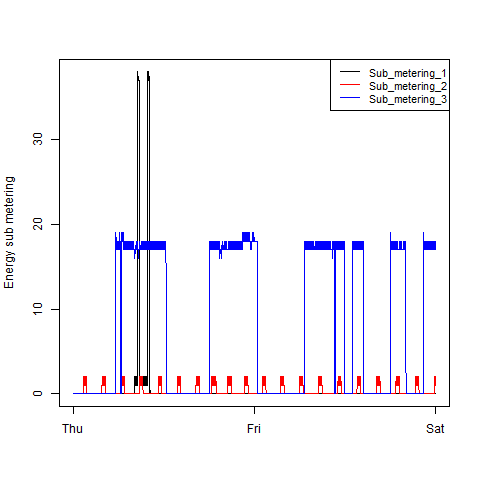

# Introduction

For the Exploratory Data Analysis course the assignment is to create four scripts that each reproduce a plot.

This assignment uses data from the UC Irvine Machine Learning Repository. 

Here are the data for the project: 

<https://d396qusza40orc.cloudfront.net/exdata%2Fdata%2Fhousehold_power_consumption.zip>

Description: Measurements of electric power consumption in one household with a one-minute sampling rate over a period of almost 4 years. Different electrical quantities and some sub-metering values are available.

The following descriptions of the 9 variables in the dataset are taken from the UCI web site:

1. Date: Date in format dd/mm/yyyy
2. Time: time in format hh:mm:ss
3. Global_active_power: household global minute-averaged active power (in kilowatt)
4. Global_reactive_power: household global minute-averaged reactive power (in kilowatt)
5. Voltage: minute-averaged voltage (in volt)
6. Global_intensity: household global minute-averaged current intensity (in ampere)
7. Sub_metering_1: energy sub-metering No. 1 (in watt-hour of active energy). It corresponds to the kitchen, containing mainly a dishwasher, an oven and a microwave (hot plates are not electric but gas powered).
8. Sub_metering_2: energy sub-metering No. 2 (in watt-hour of active energy). It corresponds to the laundry room, containing a washing-machine, a tumble-drier, a refrigerator and a light.
9. Sub_metering_3: energy sub-metering No. 3 (in watt-hour of active energy). It corresponds to an electric water-heater and an air-conditioner.

## Use of the scripts

For best plotting results use R and not RStudio.

1. First set the working directory where you want to create the plots

2. Save the scripts in the working directory and run the four scripts in R 
  - `source("plot1.R")`
  - `source("plot2.R")`
  - `source("plot3.R")`
  - `source("plot4.R")`
  
3. Four plots will be created in the working directory: 
  - `plot1.png`
  - `plot2.png`
  - `plot3.png`
  - `plot4.png`
  
  
## Description of the scripts

Each script will do the following procedures:

1. Create a directory 'data', if it doesn't exist, and download & unzip the data
2. Read and subset the data
3. Create a DateTime column
4. Create a plot
5. Save the plot to a png file with a width of 480px and a height of 480px

The four plots that will be constructed are shown below.

### Plot 1

 

### Plot 2

 

### Plot 3

 

### Plot 4

 

